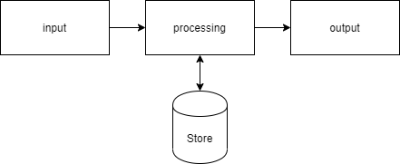
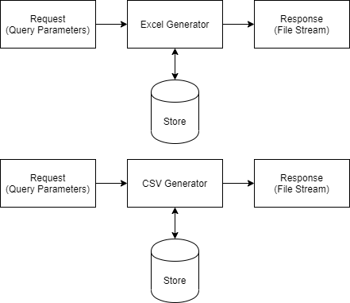
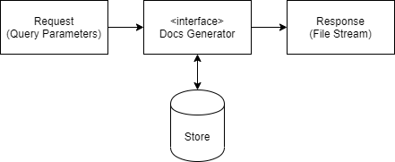

# 오늘의 개발 이야기 - Abstraction

개발 업무 진행 시 추상화(Abstraction)에 대하여 많이 들어 보셨을 것입니다.

소프트웨어의 유연성(Flexiblility)을 높이는 방법 중 하나인데요,

추상화 추상화... 중요하다고 말은 들었는데 대체 어떻게 개발에 응용할 지 감이 안잡히는 부분이 많지 않으셨나요?

그럼 제 개발 경험을 들려 드릴테니 함께 보시죠~

## 시스템 개요와 함께

때는 거슬러 올라가 제가 대학생이던 시절, 교수님은 컴퓨터 공학에서 불리우는 시스템이란 다음과 같은 것이라 말씀 하셨습니다.

1. 사용자의 입력을 받는다.
2. 적절한 자료 가공을 하여 출력을 한다.
3. 이 때 필요하다면 입/출력에 필요한 자료를 저장 한다.

이 것을 다이어그램으로 그려보면 다음과 같습니다.



여기서 하고 싶은 얘기는 이겁니다.

여러분이 이 가상의 시스템을 이용하는 사용자라 가정 하겠습니다.

이 때, 여러분은 이 시스템이 **어떻게 동작되는지** 관심이 있으십니까?

혹은 알 필요가 있다고 보십니까?

추상화의 시작은 여기서 출발합니다!

## 시작은 문서 생성기와 함께

다시 제 학창시절 얘기를 계속 해 보겠습니다.

때는 어느 여름, 한창 교수님이 내어주신 숙제를 Java 프로그램으로 코딩하고 있을 때 였습니다.

당시 과제의 주제가 독특했는데, `경마 자료 관리` 였습니다.

허허.. 이게 뭔 `말`도 안되는 `말`일까요.

말이 웃겠군요 🤣


주제와는 별개로 여기서 저는 기발한 생각을 가집니다.

사용자가 경마 선수 자료와 경주마 자료를 검색하고 그 결과를 엑셀(xls)과 csv 로 자료를 다운로드 받는 것을요.

얼핏보면 둘 다 spread-sheet 자료로써 비슷해 보이지만, 개발적인 관점에서 보면 둘은 엄연히 다른 자료 입니다.

받아들이는 데이터는 같을지언정 처리되는 과정과 그것의 결과물인 출력되는 자료는 다른 것이기 때문이죠.

저는 초심자였기에 당연히(?) 둘의 내용을 class 로 만들어 각기 따로 구현하고 사용처도 달랐습니다.

각각의 처리 과정을 다이어그램으로 그려보면 이러합니다.



보시다시피 2개로 나눠져 처리되고 있습니다.

따라서 처음엔 별도의 java 파일로 나눠서 처리 하였습니다.

```java
class XSLGenerator {
  public XSLGenerator(DBService service, String request) {
    // ...code
  }
  public Stream getStream() {
    // ... code
  }
}

class CSVGenerator {
  public CSVGenerator(DBService service, String request) {
    // ...code
  }
  public Stream getStream() {
    // ... code
  }
}

class Main {
  public static void main(String[] args) {
    String type = args[0];
    String request = args[1];
    DBService service = new DBService();
    Stream stream;

    if (type === "xls") {
      XLSGenerator xlsGen = new XLSGenerator(service, request);
      stream = xlsGen.getStream();
    }
    else if (type === "csv") {
      CSVGenerator xlsGen = new CSVGenerator(service, request);
      stream = xlsGen.getStream();
    }

    if (stream !== null) {
      attachDownload(stream);
    }
  }
}
```

근데 자세히 보시면, 중간 `Generator` 만 다르지, 나머지는 시스템 관점에선 똑같습니다.

물론 File Stream 을 통한 자료는 xls 및 csv 로써 엄연히 다르지만, 이건 사용자가 받아들일 때 비로소 그 차이점을 인지하게 됩니다.

즉, 시스템 입장에선 저 결과물은 단지 byte stream 일 뿐인 것입니다.

입력부는 어차피 Query Paramter 로 동일하니 저는 하나의 class 로 처리하고 싶었습니다.

이 문서 생성기를 이용하는 시스템 입장에선 `명령`만 주고 `Byte Stream` 만 취하면 되겠다고 판단 했습니다.

```java
class XSLGenerator {
  public XSLGenerator(DBService service, String request) {
    // ...code
  }
  public Stream getStream() {
    // ... code
  }
}

class CSVGenerator {
  public CSVGenerator(DBService service, String request) {
    // ...code
  }
  public Stream getStream() {
    // ... code
  }
}

class DocsGenerator {
  public DocsGenerator(DBService service, String type, String request) {
    // ...code
  }
  public Stream getStream() {
    if (type === "xls") {
      XLSGenerator xlsGen = new XLSGenerator(service, request);
      return xlsGen.getStream();
    }
    else if (type === "csv") {
      CSVGenerator xlsGen = new CSVGenerator(service, request);
      return xlsGen.getStream();
    }

    return null;
  }
}

class Main {
  public static void main(String[] args) {
    String type = args[0];
    String request = args[1];
    DBService service = new DBService();
    // 생성기로 명령을주고
    DocsGenerator docsGen = new DocsGenerator(service, type, request);
    // 필요한 스트림만 가져옵니다.
    Stream stream = docsGen.getStream();

    if (stream !== null) {
      attachDownload(stream);
    }
  }
}
```

좀 그럴듯 해 졌습니다. 하지만 저는 뭔가 부족하다고 느꼈습니다.

DocsGenerator 내에서는 여전히 두개로 나눠서 처리되고 있었기 때문입니다.

## 과감한 시도

여기에서 저는 생애 최초로 `interface`를 활용 해 보기로 했습니다.



코드는 다음과 같았습니다.

```java
interface IDocsGenerator {
  public Stream getStream();
}

class XSLGenerator implements IDocsGenerator {
  public XSLGenerator(DBService service, String request) {
    // ...code
  }
  public Stream getStream() {
    // ... code
  }
}

class CSVGenerator implements IDocsGenerator {
  public CSVGenerator(DBService service, String request) {
    // ...code
  }
  public Stream getStream() {
    // ... code
  }
}

class DocsGenerator {
  private IDocsGenerator docsGen

  public DocsGenerator(DBService service, String type, String request) {
    this.docsGen = (type === "xls")
      ? new XLSGenerator(service, request)
      : new CSVGenerator(service, request)
      ;
  }
  public Stream getStream() {
    return docsGen.getStream();
  }
}

class Main {
  public static void main(String[] args) {
    String type = args[0];
    String request = args[1];
    DBService service = new DBService();
    // 생성기로 명령을주고
    DocsGenerator docsGen = new DocsGenerator(service, type, request);
    // 필요한 스트림만 가져옵니다.
    Stream stream = docsGen.getStream();

    attachDownload(stream);
  }
}
```

쓰다보니 문득 또다른 좋은 생각이 떠올랐습니다.

이거 받을 때 아예 인터페이스로 받게 하자! ..정도 였던 것이죠.

그래서 아래와 같이 바뀌었습니다.

```java
interface IDocsGenerator {
  public Stream getStream();
}

class XSLGenerator implements IDocsGenerator {
  public XSLGenerator(DBService service, String request) {
    // ...code
  }
  public Stream getStream() {
    // ... code
  }
}

class CSVGenerator implements IDocsGenerator {
  public CSVGenerator(DBService service, String request) {
    // ...code
  }
  public Stream getStream() {
    // ... code
  }
}

class DocsGeneratorCreator {
  public static IDocsGenerator create(DBService service, String type, String request) {
    IDocsGenerator docsGen = (type === "xls")
      ? new XLSGenerator(service, request)
      : new CSVGenerator(service, request)
      ;

    return docsGen;
  }
}

class Main {
  public static void main(String[] args) {
    String type = args[0];
    String request = args[1];
    DBService service = new DBService();
    // 생성기로 명령을주고
    IDocsGenerator docsGen = DocsGeneratorCreator.create(service, type, request);
    // 필요한 스트림만 가져옵니다.
    Stream stream = docsGen.getStream();

    attachDownload(stream);
  }
}
```

이렇게 해서 프로젝트는 완성이 되었고, 교수님은 이 코드를 보시더니 **이것이야 말로 내가 수업 때 예기했던 다형성(polymophism)의 전형적인 사용 형식이다!** 라고 하셨습니다.

덤으로 이러한 패턴이 `팩토리 (Factory)` 혹은 `팩토리 메서드 (Factory Method)` 패턴이라는 것을 알려 주셨지요!

## 추상화란 다형성을 응용하는 것입니다

객체지향 3대 요소라는 것으로

- 캡슐화 (Encapsulation)
- 상속 (inheritance)
- 다형성 (polymophism)

..이 있습니다.

이 중 `다형성`은 저도 이해하고 사용하기까지 상당히 오랜시간이 필요했습니다.

앞서 알려드린 우연찮게 접할 기회가 마련되지 않았다면, 어쩌면 아직 저도 그 응용방법에 대하여 고민하고 있었을지도 모르지요.

이 후 여러가지 업무적 패턴을 접하게되며 조금씩 응용해 보기 시작 했습니다.

`디자인 패턴 (Design Pattern)`의 중요성이 점점 눈에 보이기 시작 한 것입니다.

디자인 패턴은 이런 다양한 추상적 응용 방법을 선구자(?)들께서 연구하고 정리한 설계적인 이론이라는 것도 알게 되었습니다.

다만, 아시다시피 상당한 러닝커브가 있어서 저도 아직 다 익혀서 응용하진 못하고 있습니다 ㅜㅜ

워낙에 많아야죠 ㅎㅎ

소프트웨어 설계적인 관점에선, 미리 설계하여 개발하는 Up-Down 방식이 가장 이상적이나, 아마도 대부분의 개발 과정에선 미리 만들고 그에 맞춰 재설계하는 Down-Up 방식이 보편적일 것입니다.

추상화도 그러하다 봅니다.

경험에 따라 `어머! 이건 추상화 해야해!` 라는 부분이 보인다면 시도 해 보세요!


다만, 이렇게 삘(feel)이 오지 않은 부분이 많으므로 섣불리 무리하게 디자인 패턴을 적용하는 것은 오히려 독이될 수도 있습니다.

이 때는?

차가운 커피한잔 ☕ 의 여유와 함께 동료들과 함께, 우리 얘기 해 보아요!

분명 즐거운 시간이 될겁니다~~! 😀
