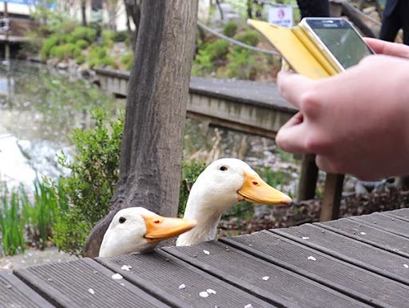
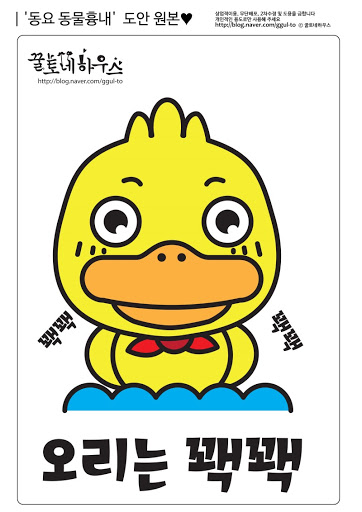

# 오늘의 개발 이야기 - Duck Typing

지난번 추상화(Abstraction)에 대하여 알아보았고, 이 내용을 보충하는 글을 써 보려 합니다.

추상화는 프로그래밍 기법에서 매우 중요하므로 지속적으로 글을 남기겠습니다.

## 오리는 마시쪙

여러분! 오리고기 좋아 하시나요?

제가 어렸을 적, 닭고기는 좋아 했으나 오리고기는 거부감이 있었습니다.

아니 이렇게 귀여운(?) 오리를 잡아먹는다니! 너무나 잔인하게 생각 되었던 것이죠.



그러나 막상 먹어보니 뭔가 쫄깃하고 고소한 것이 돼지고기와는 다르지만 암튼 맛있다! ..였습니다.

10대 초반, 어렸을적 멋모르고 이모를 따라갔던 이 경험이 훗날, 오리고기를 맛있게 먹게된 계기가 된 것입니다.

## 오리는 꽥꽥

집 근처 근린공원을 걷다보면 오리가 자주 보입니다.

암컷은 몰라도 수컷 목에 빛나는 녹색 깃털이 있는 것으로 보아 **청둥오리** 였습니다.

물론 얘네들 울음소리는 **꽥꽥** 입니다.

농장에서 기르는 가축 오리 울음소리는 어떨까요? 넵. **꽥꽥** 입니다.

생긴게 오리처럼 생기고 꽥꽥 거리면 그냥 **오리** 입니다.

사실, 거위나 백조(고니), 기러기 등은 모두 **오리과** 에 속하기 땜에 오리처럼 생겼습니다!

근데, **꽥꽥** 거리지 않으니 오리는 아닙니다.

네? 걔네들도 꽥꽥거린다구요?

뭐.. 그럼 걔네들도 **오리** 겠군요 (웃음)



## 우리는 모두 오리

이렇게 오리를 판별하는 근거처럼,

특정 기능이 유사 할 경우, 해당 함수나 객체의 사용 방법 및 구성 요소 역시 비슷하게 만들어 사용하는 것을 말합니다.

버튼이 있다고 가정 했을 때

1. 뭔가 텍스트를 넣어서 출력할 수 있고
2. 클릭 했을 때 이벤트가 발생된다

이런 것들은 모두 버튼으로 본다는 것이죠!

즉, 오리처럼 생기고 오리처럼 꽥꽥 거리면 오리다! ...라는 명제와 거의 동일하게 적용 가능 합니다.

일반적인 정적 타입 언어는 그 타입의 추상화에는 interface 나 abstract class 를 요구합니다만,

javascript 는 그 사용 방법만 동일하면 언어 차원에서 자동으로 추상화가 이뤄집니다.

아마도 아래와 같은 방법을 써 본적 있으실거에요.

```js
const bankA = {
  getName() {
    return '신한은행';
  },
  sendMoney(amount) {
    api.postMoney(amount);
  }
};

const bankB = {
  getName() {
    return '우리은행';
  },
  sendMoney(amount) {
    passMoney(amount);
  }
};

let bank = bankA;

console.log(bank.getName());

bank = bankB;

console.log(bank.getName());
```

보시다시피 bank 라는 변수는 서로 다른 bankA 와 bankB 를 받아서 사용하지만, 그 사용방법은 둘 다 동일 합니다.

즉 **다형성(polymorphism)** 을 사용하는 것입니다.

이러한 방식으로 전혀 다른 타입임에도 동일하게 사용토록 유도하는 기법을 두고 덕 타이핑 (duck-typing) 이라 합니다.

### TypeScript 에서의 적용

Javascript 의 superset인 TypeScript 에서도 당연히 덕 타이핑을 지원 합니다.

다만, 좀 더 명확하게 사용하기 위해 일반적으론 아래처럼 interface 를 선언하여 사용합니다.

```ts
interface Bank {
  getName(): string;
  sendMoney(amount: number): void;
}

const bankA: Bank = {
  // code..
};

const bankB: Bank = {
  // code..
}

let bank: Bank = bankA;

bank = bankB;
```

이러한 덕타이핑이 있기에, 굳이 interface 로 정의된 것을 구현 (implements) 하지 않고 저렇게 곧바로 JSON 형태로 작성하여 사용 가능 한 것입니다.

## JavaScript 에서는 class 를 고집하지 않아도 됩니다

최근 설계적인 관점에서 class 를 상속(inheritance) 받기 보단 조합(composition) 을 권장하기도 합니다.

이유는 super class 의 변경에 따른 부작용(side effect) 발생 때문 입니다.

또 한 전후 업무 구성에 있어 상호간의 의도치 않은 영향을 최소화 하기 위해 불변성(immutable)을 내세우기도 합니다.

덕 타이핑은 이러한 고민의 해결책이 될 수 있습니다.

그래서 많은 경우에, class 는 필요하지 않을 수 있습니다.

아니, 간단한 것이면 static method 로 정의하기 보단, 그냥 단일 함수(Single Function)로도 충분할 것입니다.

class 보단 구현체의 형태, 즉 덕 타이핑(TS일 경우 interface)에 의지하도록 설계 해 보세요!

친절한 JS 의 추상화 기능으로 코드가 더욱 간결 해 질 것입니다 :)

 - fin