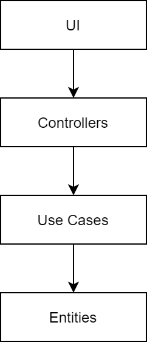
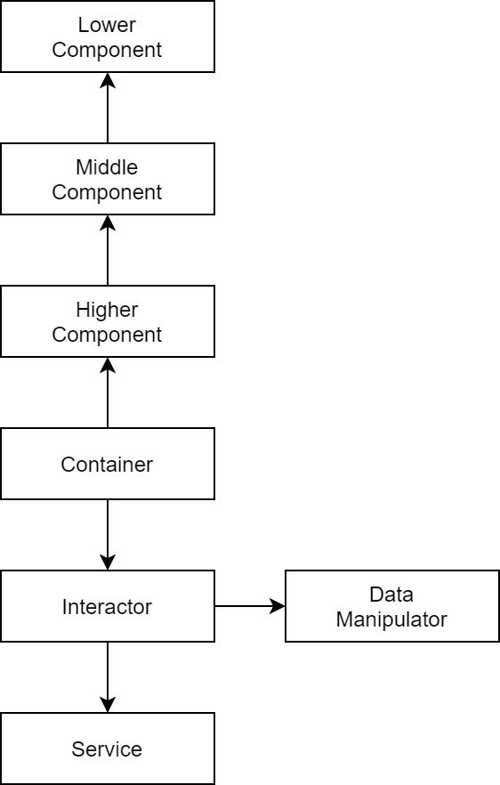
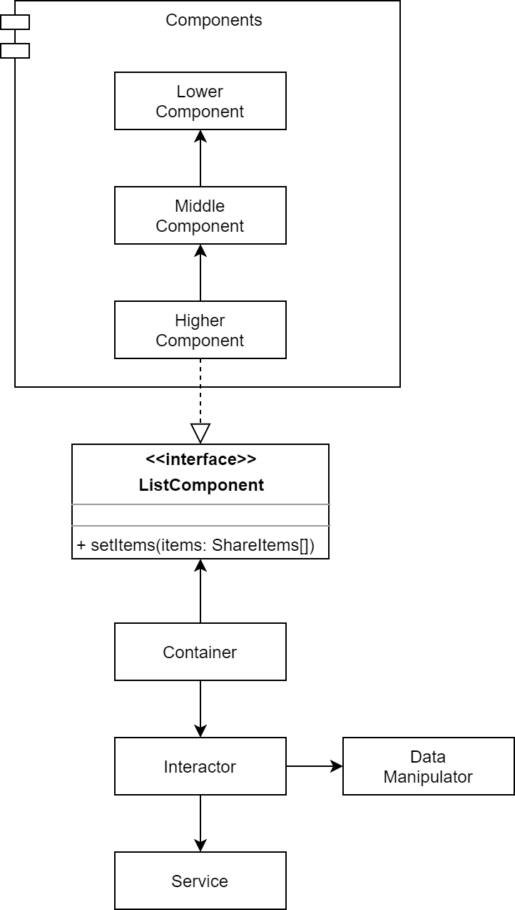

# 오늘의 개발 이야기 - Clean Architecture & DIP

오늘은 클린 아키텍처와 DIP(Dependency Inversion Principle)에 대해 이야기 해 볼까 합니다.

이야기 특성상 약간 DDD 개념도 섞여 있습니다. (100%는 아닙니다~)

이하는 제가 이해한 내용을 바탕으로 작성한 것이니 잘못 이해한 내용 있으면 언제나 댓글 남겨 주세요!

## 지향 아키텍처

웹프론트엔드의 업무용 아키텍처는 `클린 아키텍처 (Clean Architecture)` 를 지향합니다.

방법의 차이는 있겠으나 아래와 같은 의존성 방향을 준수하고 있습니다.



위에서 아래로 내려갈 수록 고수준 요소 (High Level Component) 입니다.

참고로 여기서 말하는 컴포넌트(Component)란 리액트의 UI 컴포넌트를 말하는 것이 아닌 `소프트웨어 업무 구성요소` 를 말합니다.

클린 아키텍처의 기본은 고수준이 저수준을 알지 못하게 하는 것입니다.

## 프론트엔드 아키텍처의 비교

프론트엔드는 리액트를 기반으로 업무가 구성됩니다.

이 중 Container 가 사실상 `Controller` 역할을 하고 있습니다.



엇! 근데 뭔가 이상합니다.

Container 가 하위 컴포넌트 들에게 의지하고 있군요!

이건 아래 코드와 같은 상황 입니다.

```tsx
const ShareComponent: FC = () => {
  const { items } = ctx.useCtxSelectorAll();
  return (
    <section>
      <HigherComponent items={items} />
    </section>
  );
};

export const ShareContainer = ctx.withCtx(ShareComponent);
```

하지만 상위 컴포넌트가 하위 컴포넌트에게 의지하는건 무척이나 자연스러운 현상입니다.

우리가 하는 개발 업무들이, 클린 아키텍처 관점에서 잘못된 것일까요?

아닙니다!

이건 아래와 같이 해석할 수 있습니다.



즉, `Higher Component` 는 컨트롤러에서 제공되는 인터페이스인 `ListComponent` 의 구현체일 뿐입니다.

뭔가 뜬구름 잡는거 같고, 억지스러워 보이시나요? 게다가 뜬금 없이 `ListComponent Interface` 는 또 어디서 나온건가요?

정의 한 적도 없는데 말이죠. 허허..

자~ 어이 없는 반응은 잠시 뒤로 하시고,

우리가 컴포넌트를 개발했을 때 순서를 생각해 보세요!

무엇을 먼저 만드시나요?

CSS?

Markup?

아니면.. UI Logic ?

어... 일단 tsx 파일부터 만들고 볼 수도 있겠군요!

하지만 다시 고민 해 보세요.

우리가 무엇 때문에 UI 컴포넌트를 만들고 있는지 말입니다.

## UI 컴포넌트는 껍데기

View 에 해당하는 UI 컴포넌트가 껍데기라니.. 허허..

왠지 웹프론트엔드 개발직의 자존심을 건드리는 말 같군요. 🤔

왜 이런 망언(?)이 나왔느냐 하면,

결국, UI 컴포넌트는 View 에 소속되어 있으며 View 는 API 를 통해 받은 자료를 출력하는 기능이 거의 90% 이상을 담당하기 때문입니다.

다만 우린 그 API 결과물을 View 에 그릴 때 좀 더 단순하고 최적화된 형태로 쓸 뿐인 것이죠.

(저희는 현재 [Presentation Model Pattern](https://medium.com/@sandofsky/the-presentation-model-6aeaaab607a0) 을 쓰고 있습니다)

이렇게 원천 정보를 통한 로직을 두고 `Domain Logic` 이라 부릅니다.

도메인 로직은 결국 고객이 원하는 업무를 구성하는 것을 의미 하지요.

도메인 입장에서 View 는 단지 고객이 원하는 업무를 구성하기 위한 수단일 뿐입니다!

그럼 역으로 생각 해 보세요.

컴포넌트와 도메인의 관계를 말입니다.

도메인이 과연.. 컴포넌트에 종속적(Dependency) 일까요? 아님 독립적(Independency) 일까요?

당연히 독립적이겠죠!

결국 그 복잡한 View Logic 도 도메인에서 출발하는 것이니까요.

그래서 아래와 같은 그림이 나오는 겁니다.

다시 한번 보세요!


결국 위 다이어그램의 `Higher Component` 는 Container 가 전달하는 `Items` 를 원할 뿐이고, 그 Items 는 도메인에서 정의된 것입니다.

그리고 컴포넌트에서 사용되는 items 의 원천인 `ShareItem` 을 이용할 수 있는 방법(interface)은 당연히 Controller 측에서 가지고 있겠지요!

그 것을 View 측에서 정의하진 않겠죠? ^^

View 의 멤버인 UI Component 는 단순히 가져다 쓸 뿐이니까요!

리액트에서 보자면, Props 정의할 때 쓰이는 interface 를 UI Model 에서 받게 되는 것과 같은 이치 입니다.

```tsx
import { ShareItem } from "../../models";

// Props 는 원랜 도메인을 담당하는 model 에서 제공해 주는 것이 맞으나
// 편의상 이 곳에 선언해서 쓴다 보면 됩니다.
interface Props {
  // 여기서 쓰이는 모델 ShareItem 은 컴포넌트에서 온 것이 아님을 알 수 있습니다.
  items: ShareItem[];
}

// 컴포넌트는 도메인에 종속적 입니다.
export const HigherComponent: FC<Props> = ({ items }) => {
  return (
    <ul>
      {items.map((item, idx) => (
        <MiddleComponent key={idx} item={item} />
      ))}
    </ul>
  );
};
```

이러한 이유로 화살표가 `아래`를 향하게 되는 것입니다.

이러한 현상을 두고 `Dependency Inversion (의존성 역전 원칙)` 이라 부릅니다!

OOP 의 5대 원칙 중 하나지요.

## 개발 순서를 바꿔보자

아까 했던 질문을 다시 해 보겠습니다.

웹프론트엔드 개발 할 때 무엇을 먼저 작성하시나요?

CSS? markup? ui-logic?

hoxy... `tsx`? ^^;;

이제 위 글을 보셨으면 무얼 먼저 작성해야 할지 문득 깨달으셨을 것입니다.

네! 바로 `Entity` 입니다!

엔티티는 각종 도메인 업무에 이용되는 기본 구성 요소이죠.

그담엔? 당연히 `Use Case` 입니다!

프론트엔드 아키텍처에 비유 하자면

1. Server Model 및 Ui Model 작성
2. 이들을 이용하는 각종 API & Data Service 작성
3. 이들을 이용하는 자료 조작기 (Data Manipulator) 작성

그리고 interactor 와 context, 더 나아가 container 를 작성 합니다.

어떤가요?

여러분들 개발하는 순서와 정 반대로 느껴지셨다면

`삐빅! 정상 입니다!`

가능한 한 개발시엔 도메인 구성 요소를 먼저 만들어 두세요.

이유는 간단합니다.

소프트웨어 아키텍처에 있어 도메인이 중심이 되어야 하기 때문 입니다.

그리고 View 는 젤 마지막에 만들어야 할 껍데기 입니다!

즉 개발 순서는 `고수준 → 저수준` 이 되어야 합니다.

## 마무리

모든 설계나 개발을 인터페이스로 대체하여 개발할 순 없습니다.

그건 오히려 설계 관점에서도 권장하는 바가 아닙니다.

다만 우리가 즐겨 쓰던 기술들이, 사실은 어떤 원칙과 패턴을 가지고 있더라..!

..라는 사실을 한번씩 알고 사용하면

개발 업무 할 때 좀더 재밌어지지 않을까 합니다. 🙂

-- fin
