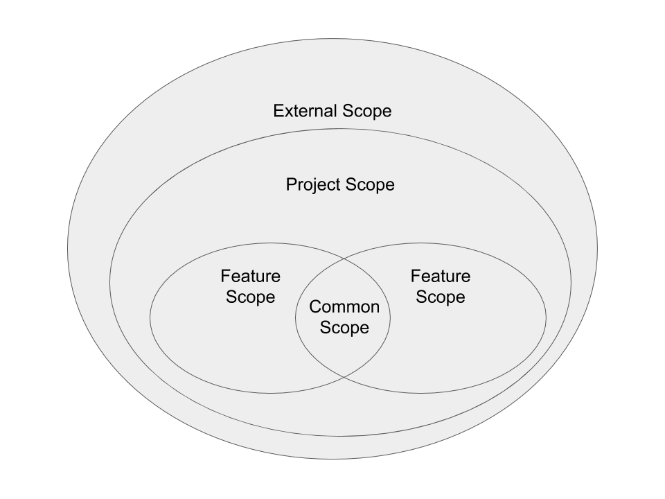

# 오늘의 개발 이야기 - Reusability

어느정도 숙달된 프로그래머라면 재사용성을 염두에 두고 개발합니다.

재사용성을 어디까지 고려 해야 할지, 그리고 어떠한 방법이 있는지

제 경험을 비추어 이 곳에 풀어 봅니다!

## 일반적인 재사용 형태

[위키백과](https://ko.wikipedia.org/wiki/%EC%BD%94%EB%93%9C_%EC%9E%AC%EC%82%AC%EC%9A%A9) 에서는 아래와 같은 재사용 형태가 있다 합니다.

- 편의적 재사용(opportunistic reuse)
  - 이미 구현된 것을 그냥 가져다 씀
- 계획적 재사용(planned reuse)
  - 만들 때 재사용 가능하게 만듬

### 편의적 재사용


다른 동료가 만든 컴포넌트나 서비스가 있나요?

근데 그걸 그냥 가져다 쓰면 업무가 수월한가요?

네. 이런 경우에 해당 됩니다.

이렇게 내부에서 쓰는 것을 `내부 재사용(internal reuse)` 이라 부릅니다.

한편, 외부 개발자가 만든 라이브러리를 가져다 쓰는 것을 `외부 재사용(external reuse)` 이라 부릅니다.

간단하죠? :)

- 장점
  - 같은 업무와 방법에 대하여 동일하게 처리 가능 합니다.
  - 구버번 대비 하위 호환성을 유지할 수 있습니다.
- 단점
  - 특정 도메인 업무에 종속적이라 유사한 패턴의 다른 업무에 접목시키기 쉽지 않습니다.
  - 리팩토링 시 이것을 바꾸면 예기치 않은 상황(side effect)이 발생될 수 있습니다.

### 게획적 재사용


다른 동료가 함께 쓸 것이라 가정하고 공용으로 선언하여 만든 것 입니다.

프론트엔드의 것을 가정하면, 각종 Service, Decorator, Factory, HOC, Custom Hooks, utility 등이 있습니다.

이들 공통점은 특정 도메인에 종속되지 않는 다는 것입니다.

즉 필요한 곳이면 어디든지 가져다 쓸 수 있다는 것이 특징입니다.

- 장점
  - 어디든 필요한 곳이면 OK!
- 단점
  - 만들기 위해선 업무의 흐름이나 아키텍처를 알고 있어야 합니다.
  - 섣불리 만들면 Over Engineering 이 되거나 의도치 않게 도메인 종속적이 될 수 있습니다.

## 재사용 범위

재사용 가능한 코드는 범위가 정해져 있습니다.

심지어 각종 언어에 기본적으로 존재하는 `String` 이나 `Integer`, `Double` 같은 Primitive Wrapper 도 각 타입에 맞게끔 적절히 써 주어야 합니다.

그럼 어떠한 범위가 있을까요?

그건 아래와 같습니다.



- 외부 범위 (External Scope)
  - 프로젝트 외/내부 어디서든 사용할 수 있습니다.
  - `lodash` 같은 각종 3rd party library 가 이에 해당 됩니다.
- 프로젝트 범위 (Project Scope)
  - 오직 현재 프로젝트 내에서만 유효한 코드 입니다.
  - 프로젝트 범위 한정, 어디서든 가져다 쓸 수 있습니다.
  - 저희가 현재 사용중인 `contextInjector` 가 대표적인 예입니다.
  - 이런 유형은 대체로 도메인에 독립적이기 때문에 사용성이 검증되고 문서화가 잘 되면 외부에 공개하여 라이브러리화 할 수 있습니다.
- 공통 범위 (Common Scope)
  - 특정 기능이 공용으로 쓰입니다.
  - 특정 도메인 업무에 종속적이므로 프로젝트 전체에 적용하여 쓰기엔 적합하지 않습니다.
  - 실 업무 범위는 비슷한 도메인을 가진 페이지 및 화면 여러개 입니다.
  - 각 출처 별로 만들어진 `Base Api` 나 `NativeAppService` 의 특정 메서드 등이 이에 해당합니다.
- 기능 범위 (Feature Scope)
  - 도메인에 종속적이라 같은 업무를 목적으로 하는 곳 외에서는 사용이 불가 합니다.
  - 실 업무 범위는 특정 페이지나 화면 1가지를 벗어나지 않습니다.
  - 굳이 쓰려면 부속 처리를 별도로 해 주어야 한다던지, Adapter 로 감싸주는 등의 별도 절차가 필요 합니다.
  - 또한 제대로 사용하기 위해선 특정 도메인 기능과 업무를 알고 있어야 합니다.
  - 전용 `DataService` 나 `Converter`, `Utility` 등이 포함 됩니다.

## 재사용성에 너무 목메이지 말자

개발 시 재사용성에 너무 매달리지 마세요!

하지만 이 말이 `그냥 아무렇게나 만들어라` 는 뜻은 아닙니다!

재사용성을 너무 의식하지 말라는 뜻이지 코드를 스파게티로 만들어도 된다는 얘기는 아닙니다!

가장 좋은 것은, 스스로 `깔끔하고 짧은 코드를 유지하도록 노력` 하는 것입니다.

즉 남들이 보기 좋은 코드로 먼저 만드세요.

이 후 본인이 업무를 진행하다가 `어! 저번에 만들었던거랑 같은거네! 가져다 써야지 ㅎㅎ` ..같은 상황이 되거나

다른 동료가 업무를 진행하다가 `어, 님! 님 만든거 좀 가져다 쓸게요! 내가 하려는거랑 거의 같네욤. ㅈㅂㅈㅇ(정보좀요) ^^`

..와 같은 상황이 오면 가져다 쓸 수 있도록 배려를 하는 것이 좋습니다.

그 배려란 앞서 말했 듯, `남들이 보기 좋은 코드` 입니다!

이러한 배려를 통해 `편의적 재사용`을 노리는 것이 가장 현실적 입니다.

## 다른 동료가 써볼만한 도구를 만들고 싶어요

Nop! 조금은 참아주세요!

지금은 각자 필요한 업무를 구성하는데만 초점을 맞추시기 바랍니다.

이러한 공통 요소들은 적절한 설계가 뒷받침되지 않으면 [Over Engineering](https://softwarebrothers.co/blog/how-to-avoid-over-engineering/) 이 되기 쉽기 때문입니다.

설계적 고민이 없다면, 공용으로 쓰기위해선 여러가지 도메인이 고려되어야 합니다.

그러면 필연적으로 다양한 도메인 모델들과 `if~else` 로 점쳐진 예외 처리가 많이 들어가게 됩니다.

이럴바엔 차라리 따로 가져가는 게 낫습니다.

## 뭔가 비슷하게 처리되고 있어요

이런 유형은 다형성 (polymorphism) 으로 처리 하세요!

처리가 필요한 곳은 같은 인터페이스나 같은 함수(입출력이 동일한 함수) 타입으로 받게 하고

외부에서는 상세한 내용은 모르게 캡슐화 (encapsulation) 시키시면 됩니다.

이러한 인터페이스가 쌓이면 하나의 공용 모델로써 관리될 수 있으며 이들은 이 후 `의존성 역전 원칙 (DIP - Dependency Inversion Principle)` 을 유지하는 핵심 장치가 됩니다!

설계적 측면에서 매우 바람직한 현상이죠!

추가적으로 UI Component 의 Props 나 State, QueryModel 들도 마찬가지 입니다!

여러분들은 구현체 (Implemention) 보다 인터페이스 (Interface) 에 초점을 맞춰 주십시요.

아래는 Dock-typing 을 통한 공통 인터페이스를 추출하여 적용 하는 과정의 예시 입니다.

```ts
// 금값을 각 국가의 환율로 변환하는 객체 입니다.
const costMaker = {
  makeDalar(gold: Gold) {
    return gold.value * usInfo.dalarValue;
  },
};
const wonCharger = {
  toKoreanWon(gold: Gold) {
    return gold.value * korInfo.wonValue;
  },
};

// -- 사용 예시 --
// costMaker 와 wonCharger 가 원래 만들어졌던 장소와 시기가 달랐던 까닭에
// 사용법은 비슷했으나, 서로 다르게 운용되고 있었습니다.
const gold = new Gold();
const country: 'us' | 'kor' = customer.country;

const cost =
  country === 'us' ? costMaker.makeDalar(gold) : wonCharger.toKoreanWon(gold);

console.log(cost);
```

```ts
// 공용 인터페이스 선언
interface GoldCostCalculator {
  calcCost(gold: Gold): number;
}

// 객체의 메서드를 정의 합니다.
// 사이드 이펙트를 방지하기 위해 Adapter 로 감쌌습니다.
const goldCostForUS: GoldCostCalculator = {
  calcCost(gold: Gold) {
    return costMaker.makeDalar(gold);
  },
};
const goldCostForKor: GoldCostCalculator = {
  calcCost(gold: Gold) {
    return wonCharger.toKoreanWon(gold);
  },
};

// 공통 인터페이스를 바라보게 되었으므로 팩토리를 사용할 수 있습니다.
function getGoldCostCalculator(country: string): GoldCostCalculator {
  if (country === 'us') {
    return goldCostForUS;
  }
  return goldCostForKor;
}

// -- 사용 예시 --
const gold = new Gold();
const calculator: GoldCostCalculator = getGoldCostCalculator(customer.country);

const cost = calculator.calcCost(gold);

console.log(cost);
```

## 결론

개발자는 장기적으로 아키텍트가 되어야 합니다.

즉 소프트웨어 설계가 가능하도록 지식과 경험을 쌓아야 합니다.

이유는 이러한 공용 기능에 대한 설계와 제작에 있습니다.

더 큰 이유로는 아키텍처를 설계하거나 설계된 아키텍처 자체를 유지보수 하기 위한 목적 입니다.

그러기 위해서는 작은 배려에 먼저 집중하여 시작 하십시요!

그 작은 배려란

`내가 아닌 동료를 위한 코드를 만들기!`

입니다!! 😉

-- fin
