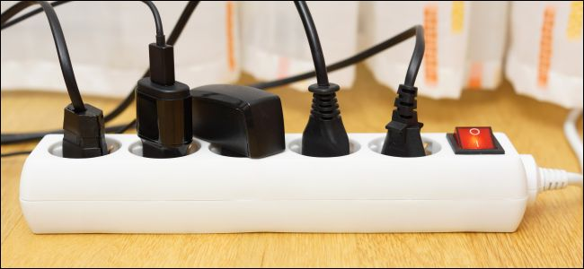
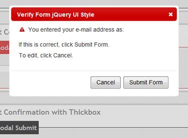
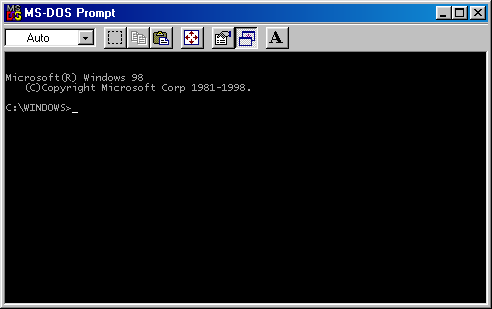

# 오늘의 개발 이야기 - interface: 소통의 수단

추상화 시리즈 3번째!

이번엔 추상화의 꽃. 인터페이스(interface) 얘기를 해 보려 합니다.

단순히 다중 상속(Multi inheritance)의 역할로만 알고 계실 이 기능의 진실(?)을

지금 파헤쳐 보겠습니다.

## 인터페이스 천국


현대 실생활에 USB(Universal Serial Bus)는 빼놓을 수 없습니다.

자료 교환, 배터리 충전, 심지어 USB-C Type 으로 모니터 출력도 가능합니다.

보통 이런 것들을 일컬어 `인터페이스` 라고 얘기 합니다.

또 다른 얘를 들어볼까요?



우리가 늘 쓰는 220V 교류형 전기 콘센트를 찾아보세요.

그리고 지금 사무실 책상위 멀티탭을 유심히 보세요!

어떤게 꽂혀져 있나요?

저는 맥북이랑 모니터 어댑터가 꽂혀 있습니다.

다른분들은 스마트폰 어댑터나 USB 허브 전원 같은게 꽂혀 있을거 같네요.

네? 닌텐도 스위치 어뎁터가 있다구요? 😅

일하다가 지치면 잠깐 동숲 켜서 놀 수도 있죠 뭐 하핫.. ~~(응? 그래도 되나?)~~

자~ 멀티탭에 꽂혀진 기기들의 종류를 떠나서 이들이 꽂힌 전원 플러그의 형태를 유심히 보세요.

어떤가요?

모두 똑같은 돼지코 `(ㅇㅇ)` 형태를 가지고 있지 않나요?

이들 전원 플러그들은 자신들이 어떻게 쓰일지 알지 못합니다.

다만 각 기기들이 필요한 전원만 줄 뿐인 것이죠.

이 역시 `인터페이스` 입니다.

## 관심 있어요? 관심 가지지 말아줘요 젭알..

앞서 말한 USB나 전원 플러그는 자신을 이용하는 다른 가전 기기들이 어떤 용도에 어떤 모습인지 전혀 상관치 않습니다.

그럼 중요한건 무엇일까요?

USB를 이용하기 위해선 USB 단자의 규격(specification)을 만족해야 하며

전원 플로그를 이용하기 위해선 그 돼지코의 규격을 만족해야만 쓸 수 있는 것입니다.

가령 USB 로 맥에 자료를 복사 해야 한다 가정 하겠습니다.

근데 아뿔싸!

제가 사용 할 맥에는 USB-C 가 아니라 썬더볼트 밖에 없군요!

그럼 변환기(Converter)나 젠더(Gender)가 필요하겠지요?

그래야 USB-C --> 썬더볼트 로 이용할 수 있으니까요.

보시다시피 어떤 기기를 이용함에 각 인터페이스는 그 규격만 갖춰지면 무슨 일이든(?) 가능 합니다.

규격이 다르다면 맞는 규격으로 변환이 필요하죠.

하지만 규격만 맞다면 그게 무엇이든 상관 없다.

이 것이 바로 인터페이스 입니다.

## 소프트웨어 공학으로

앞서 말씀드린 실생활의 인터페이스를 소개 해 드렸고

이젠 본론으로 들어가겠습니다.

혹시 실생활 인터페이스를 보고 뭔가 떠오르신 개념이 있을까요?

다형성(polymorphism)을 떠올리셨다면..?

정답입니다!

하나의 방법으로 여러가지 결과를 만들어내는 소프트웨어적 기법이죠.

다만 USB 같은 것은 굉장히 범용적이기 때문에 그 사용 범위가 넓습니다.

반면, 소프트웨어 내 인터페이스는 그 범위가 좁습니다.

가령 ORM(Object Relational Mapping) 시스템이 아래와 같은 기능을 가진다 가정 하겠습니다.

```java
interface ORMRepository<T> {
  List<T> find(int limit);
  int add(T item);
  int update(T item);
  int delete();
}
```

ORM의 목적은 Database 의 자료를 가져오거나 조작하는 행위를 객체 형태로 추상화 하는 것 입니다.

그에 따라 데이터베이스의 사용법, 그 자체를 캡슐화 시켜 마치 일반적인 객체를 이용하듯 쓸 수 있게 만듭니다.

이 때 대상이되는 DB는 MySQL, Oracle, MS-SQL 같은 RDB 나 MongoDB 와 같은 NoSQL도 포함될 수 있습니다.

한편, 좀 과정해서 XML 이나 JSON, 심지어는 File System 의 자료를 대상으로 삼을 수도 있겠으나 굳이 그러지 않습니다.

이유는 뭘까요?

ORM은 어디까지나 데이터베이스의 사용법을 추상화 시켜 객체형태로 편하게 쓰기 위함이 목적이기 때문입니다.

이걸 다른 목적으로 사용한다는 것은, 마치 전원 플러그를 전기신호 들어옴 = 1, 안들어옴 = 0 으로 이용하여 통신 회선으로 쓰려는 것과 비슷하다랄까요?

혹은 UDP 케이블및 랜선 단자를 네트워크 용도가 아니라 특정 내부 기기들 간의 자료 전송용으로만 쓰려는 것과 비슷한 이치죠.

즉 인터페이스는 실생활의 것들이 그러하듯

소프트웨어 내에서도 그 역할을 제한하여 사용하게 됩니다.

이유는?

그러려고 만든 `도구(Tool)`이기 때문입니다.

## 유저 인터페이스로

User Interface (UI) 는 컴퓨터와 사용자간의 소통을 위한 수단입니다.

허허.. 뭘 그리 뻔한걸 가지고..

다만 여기서 중요한 것은 `소통을 위한 수단` 이라는 것 입니다.

> 수단과 방법을 가리지 않는다..!

위 말은 많이 들어 보셨을 것입니다.

여기서 말하는 수단이란 무얼 의미 하는걸까요?

아뇨 아뇨! 여기 국어 시간 아닙니다 🤣🤣

그래서, 맞춰 보자면?

네. 도구 입니다.

UI 는 즉 `소통을 위한 도구`인 것입니다.



혹시 UI라 하면 위와 같은 이쁘장한(?) 것만을 떠올리셨나요?

삐빅! 정상 입니다.

위와 같은 것이 Graphic User Interface 라고 불리는 GUI 입니다.

그럼 아래는 어떠실까요?



Command Line Interface 라고 불리는 CLI 도 인터페이스 입니다.

엄연히 사용자와의 소통을 위한 UI 입니다!

허헐... 나의 UI 는 그렇지 않다구요?


새삼스레 이 글을 보는 분들은 다 아실 내용을 굳이 꺼내든 이유는

이들의 `목적`을 다시 한번 되새겨 보기 위함 입니다.

이런 목적과 동일하게 소프트웨어 공학의 interface 는 각기 다른 목적을 위하여 쓰이고 있고

이들의 `수단`은 사용자와의 소통이 아니라

**`다른 객체나 다른 함수와의 소통을 위한 수단`** 이 됩니다.

## 결론

소프트웨어 내부에서 일반적인 소통엔 굳이 인터페이스까지 필요치 않습니다.

Class, 혹은 간단한 자료라면 Integer, String 같은 기본 타입 정도로도 충분합니다.

다만 이용하는 주체(Client)에게 `나 이러저렇게 구현되고 동작되는 아주 디테일한 녀석이야~`

...라는걸 굳이 알리고 싶지 않거나

다양한 디자인 패턴으로 추상화 시켜서 `다른건 다 제쳐두고 그냥 기능만을 제공시켜 주고 싶다`면?

이 때 인터페이스가 이들 구현체와의 소통의 수단이 됩니다.

마치 여러분들이 즐겨 쓰는 USB 처럼요!

어떤게 인터페이스를 통한 추상화 대상이 될까...?

이에 대하여 동료분들과 얘기 해 보면 재밌을겁니다! 🙂

-- fin
