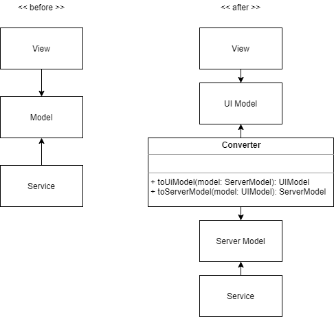
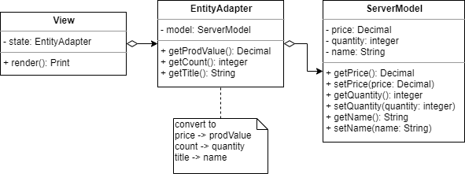
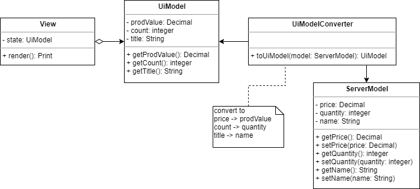
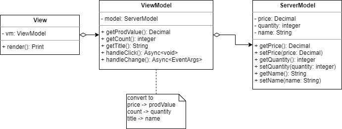

# 오늘의 개발 이야기 - Presentation Model

현대 소프트웨어 아키텍처는 데이터의 기반을 서버에 두는 `Server-Based Computing` 이 기본입니다.

이러한 서버는 UI 개발에 있어 참으로 고마우면서도 한편으론 미움의 대상이 되는, 애증 덩어리 입니다.

허허.. 우리의 소중한 서버가 애증이라니..! 😱

"이거 말이 너무 심한거 아니오..!" 😨

하하.. 너무 심했나요? 😅

그럼 과연 서버가 UI 개발에 대체 얼마나 큰 영향을 미치길래 애증이란 단어를 내밀었을련지

지금 알아보겠습니다!

## 뷰(View)? 아몰랑!

서버는 일반적으로 Database 를 관리하며 이 곳에 자료를 어떻게 쌓고, 또 외부와 통신할 때 이 데이터를 어떻게 잘 전달할지에 대해 초점이 맞춰져 있습니다.

보통 Database 에 보관되는 자료는 표(Table)의 형태를 이루며 이들을 레코드(Record)라 부릅니다.

그리고 이들을 이루는 하나하나의 항목들을 필드(Field)라 부르지요.

이렇게 행(Row)과 열(Column)으로 이뤄진 까닭은 본디 자료(Data)라 함은 일관성(Consistency)이 있어야 하기 때문입니다.

일관성이 보여야 조사하고 분석이 가능하며 나아가 정보(Information)의 근간이 되기 때문이지요.

자! 그럼 다시 UI 로 돌아와 봅시다.

그래서, 얘네들(DB)은 사용자 화면에 자료를 어떻게 뿌려줄지(How to Print)에 관심이 있다고 보시나요?

없습니다!

"엇?! 내가 하는 업무는 그냥 그대로 화면에 뿌려 주었는데요..?"

..라고 말하신다면, 그건 단순한 출력용이거나 백엔드 개발자가 기획에 맞추어 변환 해 주었을 가능성이 높습니다.

혹은 정말 화면과 ERD(Entity Relational Diagram) 설계 차원에서 화면의 각 요소를 고려하였을 수도 있습니다.

이런 경우는 단순한 업무에 감사하거나(?) 🙏

혹은 그렇게 배려해 준 백엔드 개발자에게 반드시 커피를 사 줍시다. ☕

이게 보통은 매우 번거로운 일이거든요 😅

이런 경우가 아니고서야 서버에서 내려준 자료는 일반적으로 화면(View)에 관심이 없습니다.

즉 DB나 Log 에 최적화된 정보일 수 밖에 없습니다.

## 넌(Server) 나(View)에게 모욕감을 주었어

고로 뷰에 최적화 되지 못한 자료로 UI를 구성하는 일은 매우 흔합니다.

또 한 이 것은 UI Logic 이 복잡해지는 결정적인 원인을 제공하며

이 것이 지속되면 `Smart UI`가 생겨날 가능성이 높아집니다.

> 참고로 Smart UI는 `Anti-Pattern` 중 하나입니다.
>
> 관련글 - [Smart UI (Anti-pattern)](https://web.archive.org/web/20200815114506/http://geekswithblogs.net/gregorymalcolm/archive/2009/07/14/user-interface-patterns.aspx)

이유는 다음과 같습니다.

- 복잡한 서버 모델을 UI 로직에 맞추기 위해 여러가지 변환과 조작이 이뤄진다
- 이러한 코드가 UI 안에 고스란이 들어간다.
- 코드가 길어지고 UI 특성상 테스트도 어려워진다
- 버그가 많아지며 이걸 찾아내는게 힘들어진다

즉 맞지 않는 옷을 억지로 사 입어서 내게 맞게끔 마개조하는 꼴이라 보면 됩니다.

그것도 매번 옷을 입을 때 마다 행해야 하지요!

이게 그동안 여러분이 하셨던 UI 업무 중 대부분을 차지합니다!

믿어지십니까?

우린 슬프게도 이걸 입히려는 시도를 계속 했던겁니다...

## 안맞으면 버리자!

여러분은 얼마나 성장 하셨나요?

앗..! 나이를 물어보는건 실례가 되려나요! 😅

그 보다 어렸을 적 옷을 되새겨 보세요!

여러분들이 최소 20대라 가정하고 10살때 입었던 옷을 상상 해 보겠습니다.

흠.. 🤔 입을 수 있나요?

아니, 그걸 대체 왜 입냐구요? ㅎㅎ

맞습니다!

왜 입어야 하죠?

버립시다, 그런건!

어렸을 적 안맞았던 옷들은 그저 추억으로 남겨 둡시다!

추억은 추억으로 남아야만 아름다운 법이니까요! 😉

이젠 버릴 때가 되었습니다.

옷을?

네! 서버에서 준 옷이요!

## Presentation Model Pattern

어쨌건 우린 서버에서 준 옷을 이용해야 합니다.

~~(아깐 버리람서요)~~

그럼 어떻게 이용해야 할까요? 🤔

자! 여기에 이 문제를 해결할 패턴이 있어 소개 드립니다.

그것은 바로 표현 모델을 이용한 패턴, [Presentation Model Pattern](https://martinfowler.com/eaaDev/PresentationModel.html) 입니다!

기존엔 이미 정의된 `Model`을 바탕으로 업무를 구성 하였습니다.

그래서 좌측 `before` 다이어그램처럼 View 와 Service 가 모두 `하나의 Model`을 필요로 합니다.

한편 우측 `after` 다이어그램을 보자면, View 는 **UI Model**을, Service 는 **Server Model**을 바라봅니다.

두 모델은 사용자의 자료를 담아 처리한다는 관점에선 동일하나, 그 이용 방법이 다릅니다.

따라서 둘을 서로 변환하는 변환기(Converter)가 존재하고 이들을 상호 변환 해 줍니다.

### 도입시 이점

좋은점은 다음과 같습니다.

- UI 모델은 View 에 최적화 되어있기에 UI Logic 이 최소화 될 수 있습니다.
- UI Component 가 매우 단순해지므로 `Dumb UI`를 유도하는데 매우 적합합니다.
- UI 가 단순하기 때문에 View Layer 에서는 테스트 분량을 최소화 할 수 있습니다.
- 만약 Flux 나 Clean Architecture 를 함께 응용한다면 Backend-API 가 미완성이어도 독립적으로 개발하고 mock-data 를 만들어 prototype 을 운용할 수 있습니다.
- View 는 서버에서 전달된 데이터의 구조가 어떤지 전혀 몰라도 됩니다. (=관심사 분리)
- 변환기가 있기 때문에 서비스 변화로 인하여 서버 모델이 달라지더라도 View Layer 는 전혀 영향을 받지 않습니다.

### 도입시 단점

한편 나쁜점은 다음과 같습니다.

- 각 화면(Feature, Page)별로 필요한 UI 모델을 각기 따로 만들어야 합니다.
- 사용되는 서버 모델을 UI 모델로 변환하는 변환기 역시 따로 만들어 주어야 합니다.
- 기존 서버 모델에 높은 의존성(high dependency)을 가진 화면을 리팩터링 하는 시도는 안하느니만 못합니다. (=그냥 새로 만들어야 한다는 뜻)

~~요약하면.. 귀찮다~~

## 유사한 패턴들과 비교

표현모델 패턴은 익히 알려진 `Adapter Pattern` 과 `MVVM 의 ViewModel` 과 그 역할이 유사합니다.

이들과의 차이점을 비교 해 보겠습니다.

### vs Adapter Pattern

어댑터 패턴은 사용하려는 객체나 자료를 사용처(Client)에 맞게 감싸서 제공하는 패턴 입니다.

이 때 어댑터는 내부에 원본 객체(Origin Object) 를 가지며 사용처에 맞게 forwarding 하여 제공 합니다.

따라서 내부 값이 바뀌면 외부 Adapter 도 바뀐 값을 제공하게 되며,

반대로 Adapter 로 바뀐건 내부 원본도 바뀌게 됩니다.

> 예시: EntityAdapter 안에 ServerModel 을 내포하고 View 에 필요한 필드를 적절히 변환하여 전달하는 구조 입니다.

반면 표현 모델은 내부에 그 어떤 원본도 존재하지 않습니다.

미리 변환되어 View 에 제공되며 두 모델은 서로 아무런 연관이 없습니다.

따라서 두 모델은 상호간의 변화에 대하여 독립적입니다.

> 예시: UiModel 은 ServerModel 과 별개이며 둘은 서로 불변(immutable) 입니다. View 는 온전히 UiModel 만 필요로 하며 ServerModel 에 대해선 관심이 없습니다.
>
> 이러한 UiModel 은 ServerModel 을 기반으로 변환기를 통하여 생성, 제공됩니다.

### vs MVVM's ViewModel

MVVM 패턴의 ViewModel 은 View 를 위한 Model 입니다.

내부에 원본 객체를 가지고 있으며 이를 View 에 맞게 제공하는 방법은 Adapter 와 동일합니다.

다른점은 내부에 View 에 대한 이벤트 핸들러나 기타 View 를 위한 기능이 제공된다는 점 입니다.

View가 제공된 기능을 사용하면, 내부 원본 모델은 Adapter 처럼 변화하게 될 것입니다.

> 예시: ViewModel은 View에 필요한 자료를 제공하며 동시에 필요한 기능도 제공합니다.

반면 표현 모델은 그저 자료만 제공 할 뿐입니다. 무언가 기능이 필요하다면 그건 표현 모델의 역할이 아닌 Controller 나 Interactor, Use Case, Container Component 등의 몫입니다.

물론 앞서 비교한 Adapter 처럼, 모델들은 독립적이기에 상호간의 변화에 영향을 미치지 않습니다.

> UiModel 은 기능(method, handler)은 가지지 않으며 그저 View 가 필요로 하는 자료를 맞춤형으로 제공할 뿐입니다.

## 마치며

지금껏 복잡하고 난해한 UI 로직 때문에 고생 하셨다면 이제 표현 모델 패턴을 써 보세요!

UI 개발의 시련은 이제 안녕~~! ..을 고할 수 있을겁니다.

혹시라도 더 좋은 방법을 알고 있거나 아이디어가 있으신가요?

그럼, 함께 커피 한잔씩 들고 둘러앉아 이 주제에 대하여 여유롭게 얘기 해 보는건 어떨까요?

분명 즐거운 시간이 될거에요! 😉

-- fin
